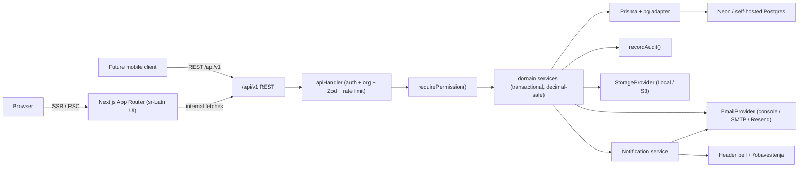

# Architecture

## 1. Overview

PropertyDesk is a multi-tenant SaaS platform for real-estate investors and
their partner agencies. The application is a single Next.js 16 (App Router)
codebase serving both the browser UI and the versioned REST API at
`/api/v1`. Postgres (Neon in production, Docker Compose in dev) is the
single source of truth. All money is stored as `Decimal(14,2)`.

## 2. Layers

| Layer | Responsibility | Location |
|-------|----------------|----------|
| **UI (RSC + client leaves)** | Serbian mobile-first pages, forms, tables. | `src/app/(dashboard)/*`, `src/features/*`, `src/components/*` |
| **REST controllers** | Zod validation, error envelope, permissions, rate limiting. | `src/app/api/v1/**/route.ts`, `src/lib/api/handler.ts` |
| **Domain services** | Transactional business rules; the only writers to Prisma. | `src/server/services/*` |
| **Repositories & Prisma** | Tenant-scoped helpers on top of `@prisma/client`. | `src/server/db/*`, `prisma/schema.prisma` |
| **Cross-cutting** | Audit, notifications, email, storage, jobs, monitoring, i18n. | `src/server/audit`, `src/server/email`, `src/server/storage`, `src/server/jobs`, `src/server/monitoring`, `src/lib/i18n` |

## 3. Multi-tenancy

- Every tenant-owned table has an `organizationId` FK.
- All service functions accept `organizationId` and every SQL predicate
  scopes on it — no exceptions.
- `requirePermission()` resolves the current session, verifies an active
  organization, and returns a typed `AuthorizedContext` used by every
  API route.
- Agencies see investor data through **separate agency-safe DTOs**
  (`src/server/services/agencies/dtos.ts`) — never via generic Prisma row
  spreads.

## 4. Concurrency & Correctness

- **Unique partial indexes** guarantee "one active reservation per unit"
  and "one active sale per unit" at the DB level.
- **Optimistic `version` columns** protect long-lived edits.
- **Prisma `$transaction`** wraps everything that touches money or
  status transitions.
- **`decimal.js`** everywhere money is computed; `formatMoney` +
  `sumMoney` prevent JS float drift.

## 5. Sections in the delivered plan

| Section | Where | Status |
|---------|-------|--------|
| 1–14 Foundation, rename, admin | Phase 1 | Delivered |
| 15 Projects / Inventory | Phase 2 | Delivered |
| 16–17, 27, 29 CRM & reservations | Phase 3 | Delivered |
| 18–19 Agencies, protection, portal | Phase 4 | Delivered |
| 20–23 Sales, payments, docs, commissions | Phase 5 | Delivered |
| 24–29 Dashboards, reports, PDFs, emails, jobs, notification centre | Phase 6 | Delivered |
| 32–36, 41–44 Security, perf, a11y, deployment, docs | Phase 7 | Delivered |
