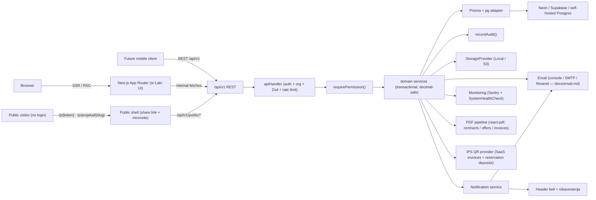

# Architecture

## 1. Overview

PropertyDesk is a multi-tenant SaaS platform for real-estate investors and
their partner agencies. Investors pay for a plan. Agencies are **free
partner accounts** (`saas_plan.code = partner`). They can self-register
or join via an investor email invite. Full inventory access still
comes from an `AgencyConnection` + `AgencyProjectAccess`, not from
signup. The network catalog is a teaser opt-in
(`networkCatalogEnabled`). The application is a single Next.js 16 (App Router)
codebase serving both the browser UI and the versioned REST API at
`/api/v1`. Postgres (Supabase on the current VPS; local via
`DATABASE_URL`) is the single source of truth. Hosts and the planned
env split: [`environments.md`](./environments.md). All money is stored
as `Decimal(14,2)`.

## 2. Layers

| Layer | Responsibility | Location |
|-------|----------------|----------|
| **UI (RSC + client leaves)** | Serbian mobile-first pages, forms, tables. | `src/app/(dashboard)/*`, `src/features/*`, `src/components/*` |
| **REST controllers** | Zod validation, error envelope, permissions, rate limiting. | `src/app/api/v1/**/route.ts`, `src/lib/api/handler.ts` |
| **Domain services** | Transactional business rules; the only writers to Prisma. | `src/server/services/*` |
| **Repositories & Prisma** | Tenant-scoped helpers on top of `@prisma/client`. | `src/server/db/*`, `prisma/schema.prisma` |
| **Cross-cutting** | Audit, notifications, email, storage, jobs, monitoring, i18n, theme. | `src/server/audit`, `src/server/email`, `src/server/storage`, `src/server/jobs`, `src/server/monitoring`, `src/lib/i18n`, `src/lib/theme` |

## 3. Multi-tenancy

- Every tenant-owned table has an `organizationId` FK.
- All service functions accept `organizationId` and every SQL predicate
  scopes on it — no exceptions.
- `requirePermission()` resolves the current session, verifies an active
  organization, and returns a typed `AuthorizedContext` used by every
  API route.
- Agencies see investor data through **separate agency-safe DTOs**
  (`src/server/services/agencies/dtos.ts`) — never via generic Prisma row
  spreads.

## 4. Concurrency & Correctness

- **Unique partial indexes** guarantee "one active reservation per unit"
  and "one active sale per unit" at the DB level.
- **Optimistic `version` columns** protect long-lived edits.
- **Prisma `$transaction`** wraps everything that touches money or
  status transitions.
- **`decimal.js`** everywhere money is computed; `formatMoney` +
  `sumMoney` prevent JS float drift.

## 5. Sections in the delivered plan

| Section | Where | Status |
|---------|-------|--------|
| 1–14 Foundation, rename, admin | Phase 1 | Delivered |
| 15 Projects / Inventory | Phase 2 | Delivered |
| 16–17, 27, 29 CRM & reservations | Phase 3 | Delivered |
| 18–19 Agencies, protection, portal | Phase 4 | Delivered |
| 20–23 Sales, payments, docs, commissions | Phase 5 | Delivered |
| 24–29 Dashboards, reports, PDFs, emails, jobs, notification centre | Phase 6 | Delivered |
| 32–36, 41–44 Security, perf, a11y, deployment, docs | Phase 7a | Delivered |
| Visual & sales layer (charts, galleries, Kanban, calendar, map, floor plan, comments, global search) | Phase 7b (Faza 7) | Delivered |
| Investor v1 hardening — payment plan templates, sale document uploads, project floor plan editor | Phase 7c (Faza 7 nastavak) | Delivered |
| Sales cycle closure (A1–A5) — contract generator, online reservation with IPS QR, cash-flow projection, time-to-sale, cost tracking & P&L | Phase 8.1 (Faza 8 A) | Delivered |
| Serbia compliance (B1–B4) — buyer KYC, VAT/RPI tax mode on sales, CSV/XLSX unit importer, project clone | Phase 8.2 (Faza 8 B) | Delivered |
| Growth + production hardening (C1–C4) — public project microsite, agency referral code, @sentry/nextjs integration, automatic backup verifier | Phase 8.3 (Faza 8 C) | Delivered |

## 6. Faza 8 module map

| Feature | Frontend surface | REST | Service | Storage / cross-cutting |
|---------|------------------|------|---------|-------------------------|
| Contract generator | `/prodaje/[id]` (contract card) + `/podesavanja/ugovori-sabloni` | `POST/PATCH /sales/:id/contract/generate,mark-sent,mark-signed` · `GET/POST/PATCH/DELETE /sale-contract-templates` | `contracts.service.ts`, `pdf/documents/sale-contract.tsx` | `Document` (PDF) + `SaleContract` row + audit |
| Online reservation | Public `/p/[token]` form + investor `/rezervacije/zahtevi` | `POST /public/share/:token/reserve` · `GET /public/reservation-requests/:id/qr` · `POST /reservation-requests/:id/{confirm,decline}` | `reservation-requests.service.ts` | IPS QR PNG in `StorageProvider` under `reservation-request/*` |
| Cash-flow projection | Dashboard card + `/izvestaji/uplate` | `GET /reports/cash-flow` | `reports/cash-flow.service.ts` | Prisma aggregation only |
| Time-to-sale | `/izvestaji/zalihe` | Included in inventory report | `reports/inventory-velocity.service.ts` | Prisma aggregation |
| Project cost & P&L | `/izvestaji/prodaje` panel + project edit form | `PATCH /projects/:id` (cost fields) | `projects/pnl.service.ts` | `Project.landCost/constructionCost/marketingCost/otherCost` |
| Buyer KYC | `/kupci/[id]` KYC tab | `GET/PATCH /buyers/:id/kyc` | `buyers/kyc.service.ts` | `BuyerKycChecklist` + `DocumentCategory.KYC` |
| VAT / RPI on sales | Sale detail card | `PATCH /sales/:id/tax` | `sales/tax.service.ts` | `Sale.vatMode/taxAmount/taxPayer` |
| CSV/XLSX unit import | `/projekti/[id]/uvoz` (3-step wizard) | `POST /projects/:id/import` | `projects/import-units.service.ts` | temporary in-memory parse |
| Project clone | `/projekti/[id]` dropdown → `CloneProjectDialog` | `POST /projects/:id/clone` | `projects/clone.service.ts` | Structure only, no sales/payments carried over |
| Public microsite | Marketing-style route `/p/projekat/[slug]` | `GET /public/projects/:slug` (via `resolvePublicProjectSite`) | `projects/microsite.service.ts` | `Project.publicMicrositeEnabled/Slug` |
| Agency referral | `/ponuda` cards + public `/p/r/<code>` catalog + `/izvestaji/agencije` | `POST /agency/referral/rotate` | `agencies.service.ts`, `referral-catalog.service.ts` | `AgencyConnection.referralCode` + cookie `pd_ref` (30d) |
| Sentry monitoring | Sentry SaaS (client/server/edge) | Instrumented via `src/instrumentation.ts` + `next.config.ts` `withSentryConfig` | `server/monitoring/index.ts` facade | Uses `SENTRY_DSN`, `NEXT_PUBLIC_SENTRY_DSN` env vars |
| Backup verifier | `/administracija/monitoring` | `POST /platform/monitoring/backup-verify` + weekly cron | `monitoring/backup-verify.service.ts` | `SystemHealthCheck` rows + email alerts |
