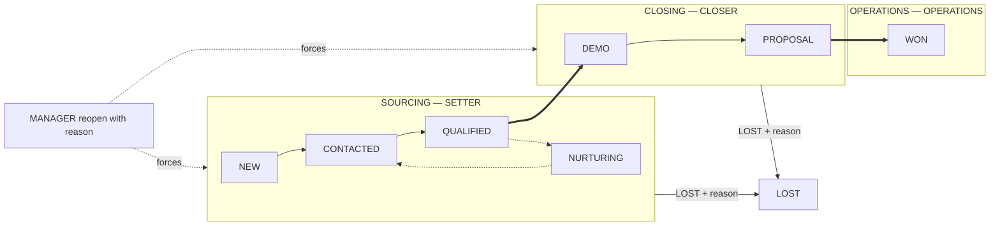

# Role, dozvole i planovi — administrativni vodič

Ovaj dokument opisuje kako super-admin uređuje **role i dozvole** i kako se
kreiraju/uređuju **SaaS planovi** za organizacije.

---

## 0. Dva sloja autorizacije

PropertyDesk odvaja **dva jasno različita autorizaciona sloja**. Nikad se ne
kombinuju u istoj kartici / ekranu / tabeli.

### Sloj A — Platforma / Nalog

Odgovara na pitanje: **„Da li nalog uopšte ima pristup aplikaciji?"**

| Elemenat | Gde živi |
|---|---|
| Platform rola (`SUPER_ADMIN`) | `User.role` u tabeli `user` |
| Pretplata | `organization_subscription` (`status`, `billingCycle`, `trialEndsAt`) |
| Plan (paket) | `saas_plan` (kvote, cene, feature flag-ovi) |
| Profil naloga / status | `organization_profile.status` (`TRIAL` / `ACTIVE` / `RESTRICTED` / `SUSPENDED` / `CLOSED`) |
| RESTRICTED allowlist | `global_billing_settings.restrictedModeAllowedPermissions` |
| Fakture / uplate | `invoice`, `subscription_payment` |

**UI ekrani (super-admin):**

- **Administracija → Organizacije** — status naloga, aktivacija/suspenzija.
- **Administracija → Planovi** — CRUD SaaS planova.
- **Administracija → Naplata** — subscription lifecycle, fakture, RESTRICTED
  režim, bankovni izvodi.
- **Administracija → Korisnici** — platform rola (SUPER_ADMIN) + impersonacija.

### Sloj B — Aplikacija (unutar organizacije)

Odgovara na pitanje: **„Šta ulogovani član radi u aplikaciji svoje
organizacije?"**

| Elemenat | Gde živi |
|---|---|
| Aplikaciona rola u org-u | `member.role` (INVESTOR_OWNER, SALES_MANAGER, SALES_AGENT, FINANCE, INVESTOR_VIEWER, AGENCY_OWNER, AGENCY_ADMIN, AGENCY_AGENT, AGENCY_VIEWER) |
| Default matrica rola → dozvole | `src/server/permissions/roles.ts` |
| Kanonske dozvole (`resurs.akcija`) | `src/server/permissions/access-control.ts` |
| Override sloj | `role_permission_override` (tabela) |
| Runtime helper | `requirePermission("resurs.akcija")` |

**UI ekrani:**

- **Administracija → Uloge i dozvole (aplikacija i platforma)** — matrica
  po roli; jasno razdvojeno „Platforma" (SUPER_ADMIN) i „Aplikacija" (org
  role).
- **Podešavanja → Korisnici** (unutar tenanta) — dodela **aplikacione**
  role članovima organizacije; NE dira subscription / plan.

### Sloj C — Property Desk (interni tim za marketing SaaS-a)

Odgovara na pitanje: **„Ko iz našeg tima obrađuje marketing lead-ove i
prodaje sam PropertyDesk SaaS?"**

Ovo je platformski sloj potpuno **odvojen** od Sloja A (SUPER_ADMIN) i
Sloja B (tenant `Member.role`). Član Property Desk tima ne dobija
automatski `SUPER_ADMIN` — i obrnuto, SUPER_ADMIN uvek prolazi Property
Desk provere kao bypass.

| Elemenat | Gde živi |
|---|---|
| Team rola (`SETTER`, `CLOSER`, `OPERATIONS`, `MANAGER`) | `property_desk_team_member.teamRole` |
| Vidljivost lead-ova | `property_desk_team_member.leadScope` (`OWN`, `OWN_AND_UNASSIGNED`, `TEAM`, `ALL`) |
| Aktivacija | `property_desk_team_member.enabled` |
| Persistirani lead-ovi | `marketing_lead` |
| Runtime helper | `requirePropertyDeskAccess()`, `requirePdPermission(ctx, "pd_*")`, `hasPdPermission(ctx, "pd_*")`, `canViewMarketingLead(ctx, lead)` |

**UI ekrani (samo SUPER_ADMIN + aktivan member):**

- **Administracija → Property Desk (tim) → Pregled** — pipeline stats,
  poslednji lead-ovi.
- **Administracija → Property Desk (tim) → Tim** — CRUD internog tima
  (SUPER_ADMIN dodaje/uklanja, MANAGER menja scope/enabled).
- **Administracija → Property Desk (tim) → Lead-ovi** — lista pipeline-a
  sa filterima; detalj sa stage action bar, dodela vlasnika, konverzija u
  tenant organizaciju.

### Kanonska mapa („industrijski" nazivi ↔ postojeće role)

Sales/marketing dokumenti u ovoj industriji koriste žargon „Setter",
„Closer", „Operations", „Property Desk Manager". U PropertyDesk-u ovo su
**Sloj C — Property Desk internal team** role (interni tim koji marketira
i prodaje SaaS), NE tenant aliasi:

| Kanonski naziv | Gde postoji u sistemu | Šta radi |
|---|---|---|
| Setter | `property_desk_team_member.teamRole = SETTER` | prihvata nove lead-ove sa landing forme, prvi kontakt (`stage: NEW → CONTACTED → QUALIFIED`) |
| Closer | `property_desk_team_member.teamRole = CLOSER` | vodi kvalifikovane lead-ove do zaključka (`stage: QUALIFIED → DEMO → PROPOSAL → WON`) |
| Operations | `property_desk_team_member.teamRole = OPERATIONS` | onboarding, tehnička operativa u lead-u |
| Property Desk Manager | `property_desk_team_member.teamRole = MANAGER` | menadžer tima; vidi sve lead-ove, uređuje scope drugih, ne može da menja teamRole (to je SUPER_ADMIN) |

**Property Desk Manager NIJE Super Admin.** Menadžer nema `platform.*`
dozvole, ne upravlja pretplatom, ne dodeljuje tenant Member.role. Super
Admin je odvojena platformska rola.

**Tenant `Member.role` je Sloj B** — ako neki investitor želi da svog
prodavca zove „Setter" ili „Closer", to je stvar interne komunikacije;
sistemski se koristi `SALES_AGENT`, `SALES_MANAGER` itd. Property Desk
role postoje isključivo za interni tim SaaS-a.

### Zašto ova podela

- Član organizacije se dodaje / oduzima kroz **Podešavanja → Korisnici**
  i to NE menja pretplatu ni plan.
- Menjanje plana / suspendovanje pretplate ide kroz **Administracija →
  Naplata** i to NE menja dodeljene aplikacione role.
- Ako je nalog u `RESTRICTED` režimu, aplikacione dozvole se filtriraju
  kroz `restrictedModeAllowedPermissions` (samo billing / read
  operacije). Rola se ne dira.
- `SUPER_ADMIN` je globalni override — ima pristup obama slojevima, ali
  se konfiguriše na svom mestu (`user.role`), a ne kroz `member.role`.

---

## 0.1. Property Desk internal team (Sloj C)

Interni tim PropertyDesk-a — ljudi koji **marketiraju i prodaju sam SaaS**
— radi u odvojenoj tabeli `property_desk_team_member` i pipeline-u
`marketing_lead`. Ovaj sloj se ne meša sa tenant članovima; korisnik može
istovremeno biti SUPER_ADMIN, Property Desk MANAGER i imati nula tenant
članstava, ili samo tenant SALES_AGENT bez ikakvog Property Desk pristupa.

### Team role

| `teamRole` | Šta radi | Ko dodeljuje |
|---|---|---|
| `SETTER` | Prvi kontakt, kvalifikacija, prebacivanje CLOSER-u | SUPER_ADMIN |
| `CLOSER` | Vodi demo/ponudu do WON/LOST | SUPER_ADMIN |
| `OPERATIONS` | Onboarding, tehnička podrška na leadu | SUPER_ADMIN |
| `MANAGER` | Cross-team vidljivost, dodela lead-ova, uređivanje scope-a | SUPER_ADMIN |

### Vidljivost lead-ova (`leadScope`)

Svaki član ima `leadScope` — koji lead-ovi mu se prikazuju:

- `OWN` — samo lead-ovi gde je `assignedToUserId` = njegov `userId`.
- `OWN_AND_UNASSIGNED` — plus svi lead-ovi bez vlasnika (default za
  SETTER/CLOSER).
- `TEAM` — svi lead-ovi cele Property Desk ekipe (za koordinatore).
- `ALL` — svi lead-ovi (implicitno za MANAGER i SUPER_ADMIN).

Provera se radi kroz `canViewMarketingLead(ctx, lead)` i
`buildMarketingLeadScopeFilter(ctx)` u
`src/server/permissions/property-desk.ts`. Ove funkcije prvo konsultuju
dozvolu `pd_lead.view_team` (kroz `isPermittedWithOverrides`) — ako je
data (ili je pozivalac SUPER_ADMIN), scope se preskače i vidi se ceo
pipeline. Ako nije, primenjuje se `leadScope` člana kao klasičan filter.

### Leveli (Sourcing / Closing / Operations / Archived)

Iznad stage-a postoji `MarketingLead.level` — koarse pipeline sloj koji
kontroliše koga tim ekipa uopšte vidi. Level se **deriviše iz stage-a**
(single source of truth: `STAGE_TO_LEVEL` u
[`src/server/services/property-desk/lead-lifecycle.ts`](../src/server/services/property-desk/lead-lifecycle.ts))
i nikad se ne postavlja ručno.



Mapiranje stage ↔ level:

| Stage | Level |
|---|---|
| `NEW`, `CONTACTED`, `QUALIFIED`, `NURTURING` | `SOURCING` |
| `DEMO`, `PROPOSAL` | `CLOSING` |
| `WON` | `OPERATIONS` |
| `LOST` | `ARCHIVED` |

Vidljivost po levelu (`ROLE_LEVELS`):

| Team rola | Vidi levele |
|---|---|
| `SETTER` | `SOURCING` |
| `CLOSER` | `CLOSING` |
| `OPERATIONS` | `OPERATIONS` |
| `MANAGER` | `SOURCING`, `CLOSING`, `OPERATIONS`, `ARCHIVED` |

`leadScope` (`OWN` / `OWN_AND_UNASSIGNED` / `TEAM` / `ALL`) i dalje važi,
ali **primenjuje se unutar levela**: SETTER sa `OWN` vidi samo svoje
lead-ove u `SOURCING`, ne one koji su već prešli u `CLOSING`. Ko god
ima `pd_lead.view_team` (default samo MANAGER) preskače i level i
leadScope filter i vidi ceo pipeline.

### Forward-only pipeline + reopen

Stage tranzicije su **jednosmerne**. Dozvoljena sledeća stanja definiše
`FORWARD_TRANSITIONS`:

| Iz | U (dozvoljeno) |
|---|---|
| `NEW` | `CONTACTED`, `NURTURING`, `LOST` |
| `CONTACTED` | `QUALIFIED`, `NURTURING`, `LOST` |
| `QUALIFIED` | `DEMO`, `NURTURING`, `LOST` |
| `NURTURING` | `CONTACTED`, `QUALIFIED`, `LOST` |
| `DEMO` | `PROPOSAL`, `LOST` |
| `PROPOSAL` | `WON`, `LOST` |
| `WON` | (terminalno) |
| `LOST` | (terminalno) |

Sve što nije u tabeli (npr. `DEMO → QUALIFIED`, `WON → PROPOSAL`,
`LOST → NEW`) zahteva **`pd_lead.reopen`** dozvolu **i obavezan
`reopenReason`** (min 3 karaktera). Bez oba dva `updateMarketingLead`
baca `AppError("VALIDATION", …)`. Reopen se posebno auditira kao
`marketing_lead.reopened` i upisuje `SYSTEM` timeline red sa razlogom.

Kad tranzicija **pređe granicu levela** (npr. `QUALIFIED → DEMO`
=Sourcing→Closing, ili `PROPOSAL → WON` =Closing→Operations), servis
automatski:

- postavlja `previousLevel = prev.level`, `levelEnteredAt = now()`,
- radi **auto-unassign** (`assignedToUserId = null`) da lead uđe u pool
  sledećeg levela,
- upisuje `SYSTEM` aktivnost „Lead prebačen na level X (auto-unassign)".

Rezultat: SETTER gubi vidljivost istog trenutka kad lead ode u
`CLOSING`, a CLOSER ga preuzima iz pool-a. Isto važi za prelazak u
`OPERATIONS` po `WON`.

### Klasifikacija i score

Novi opcioni podaci se snimaju kroz `pd_lead.update_details` odnosno
`pd_lead.update_classification` (default svim PD članovima, ali samo za
lead-ove u sopstvenom levelu — `canWriteLead` guard). Pregled polja:

| Grupa | Polja |
|---|---|
| Klasifikacija | `priority` (LOW/NORMAL/HIGH/URGENT), `temperature` (COLD/WARM/HOT), `timelineHorizon` (WITHIN_30D/WITHIN_90D/LATER/UNDECIDED), `nextFollowUpAt`, `leadScore` |
| Firma | `companyName`, `companyWebsite`, `companySize` |
| Novac | `budgetTier` (STARTER/GROWTH/ENTERPRISE/UNKNOWN), `budgetCurrency` |
| Ljudi | `decisionMakerName`, `decisionMakerTitle`, `preferredContact` (PHONE/EMAIL/WHATSAPP/VIBER/OTHER), `bestContactHour` |
| Konkurencija | `competitor`, `painPoint` |
| Geo / jezik | `country`, `region`, `preferredLanguage` |

`leadScore` se računa **deterministički** u
[`lead-scoring.ts`](../src/server/services/property-desk/lead-scoring.ts)
i osvežava se automatski na svakom create / update koji dira relevantna
polja. Formula (max 100):

- pipeline stage: CONTACTED +8, QUALIFIED +15, NURTURING +5, DEMO +25,
  PROPOSAL +35, WON +45 (NEW i LOST = 0)
- company name + website popunjeni: +10
- companySize ≥ 10: +10; ≥ 50: +20
- budgetTier: STARTER +5, GROWTH +15, ENTERPRISE +25
- timelineHorizon: WITHIN_30D +25, WITHIN_90D +15, LATER +5
- decisionMakerName + decisionMakerTitle popunjeni: +10
- temperature: WARM +8, HOT +15

Score se koristi za dashboard „Hot lead-ovi", default sortiranje liste i
filter `minScore` u query-ju.

### Pipeline i konverzija u tenanta

`MarketingLead.stage` prati stanje: `NEW → CONTACTED → QUALIFIED → DEMO →
PROPOSAL → WON` (paralelni terminali su `LOST` i `NURTURING`).
„Konvertuj" akcija u detalju lead-a postavlja
`convertedOrganizationId` (FK na `organization`), `stage = WON`,
`convertedAt` i upisuje audit `marketing_lead.converted`. Na L3,
Operations i Super Admin mogu iz istog ekrana da **naprave novi tenant**
(org + vlasnik najvišeg stepena + plan) sa predpopunjenim poljima iz
lead-a, umesto da org prvo kreiraju u Administracija → Organizacije.

### API i ekrani

- API: `/api/v1/platform/property-desk/team/**` i
  `/api/v1/platform/property-desk/leads/**`, svi ispod
  `requirePropertyDeskAccess()`.
- UI: `/administracija/property-desk` (dashboard),
  `/administracija/property-desk/tim`,
  `/administracija/property-desk/leadovi[/id]`.
- Landing forma `POST /api/v1/marketing/leads` je javna i i dalje sinca
  sa Loops-om — pored toga upsert-uje red u `marketing_lead`.

### Matrica dozvola po roli (Sloj C)

**Sloj C je editabilan.** Property Desk role i dozvole (`pd_*`) su
integrisane u isti override sistem kao aplikacione uloge. Podrazumevane
vrednosti su definisane u
[`src/server/permissions/roles.ts`](../src/server/permissions/roles.ts)
(role `SETTER`, `CLOSER`, `OPERATIONS`, `MANAGER`), a SUPER_ADMIN ih
može remapirati kroz **Administracija → Role i dozvole** — sasvim isti
ekran koji uređuje Sloj A i B. Guard funkcije u
[`src/server/permissions/property-desk.ts`](../src/server/permissions/property-desk.ts)
konsultuju `isPermittedWithOverrides()`, tako da izmena u UI-ju
proizvodi efekat bez redeploy-a.

Legenda: ✔ = default = sme, ✘ = default = ne sme, **SA** = po default-u
samo SUPER_ADMIN (može se dodeliti bilo kojoj drugoj roli kroz UI).

| Akcija | Dozvola | SETTER | CLOSER | OPERATIONS | MANAGER |
|---|---|:---:|:---:|:---:|:---:|
| **Tim** | | | | | |
| Pregled članova tima | `pd_team.view` | ✘ | ✘ | ✘ | ✔ |
| Dodavanje / uklanjanje člana | `pd_team.add_member` | SA | SA | SA | SA |
| Promena uloge (`teamRole`) | `pd_team.manage_role` | SA | SA | SA | SA |
| Promena `leadScope` člana | `pd_team.manage_scope` | SA | SA | SA | SA |
| Onemogući / omogući člana | `pd_team.disable` | SA | SA | SA | SA |
| **Lead-ovi** | | | | | |
| Vidi svoje lead-ove | `pd_lead.view_own` | ✔ | ✔ | ✔ | ✔ |
| Vidi lead-ove celog tima | `pd_lead.view_team` | ✘ | ✘ | ✘ | ✔ |
| Ručno kreiranje lead-a | `pd_lead.create` | ✔ | ✔ | ✘ | ✔ |
| Prosleđivanje / dodela | `pd_lead.reassign` | ✘ | ✘ | ✘ | ✔ |
| Promena faze (forward) | `pd_lead.update_stage` | ✔ | ✔ | ✔ | ✔ |
| Uređivanje detalja | `pd_lead.update_details` | ✔ | ✔ | ✔ | ✔ |
| Uređivanje klasifikacije | `pd_lead.update_classification` | ✔ | ✔ | ✔ | ✔ |
| Vraćanje faze unazad / preskakanje | `pd_lead.reopen` | ✘ | ✘ | ✘ | ✔ |
| Konverzija u tenant org. | `pd_lead.convert` | ✘ | ✔ | ✔ | ✔ |
| Trajno brisanje | `pd_lead.delete` | SA | SA | SA | SA |
| Bulk operacije | `pd_lead.bulk` | ✘ | ✘ | ✘ | ✔ |
| **Timeline aktivnosti** | | | | | |
| Čitanje timeline-a | `pd_lead_activity.read` | ✔ | ✔ | ✔ | ✔ |
| Ručni unos aktivnosti | `pd_lead_activity.create` | ✔ | ✔ | ✔ | ✔ |
| **Taskovi** | | | | | |
| Čitanje taskova | `pd_lead_task.read` | ✔ | ✔ | ✔ | ✔ |
| Kreiranje taska | `pd_lead_task.create` | ✔ | ✔ | ✔ | ✔ |
| Dodela drugom članu | `pd_lead_task.assign` | ✘ | ✘ | ✘ | ✔ |
| Označavanje kao završen | `pd_lead_task.complete` | ✔ | ✔ | ✔ | ✔ |
| **Izveštaji** | | | | | |
| Pipeline izveštaji | `pd_report.pipeline` | ✔ | ✔ | ✔ | ✔ |

Napomene:

- „Vidi lead-ove celog tima" (`pd_lead.view_team`) preskače provere nad
  `leadScope` **i** nad levelima — ko god ga dobije, vidi ceo pipeline.
  Preostali članovi se filtriraju prvo prema `ROLE_LEVELS` (SETTER samo
  `SOURCING`, CLOSER samo `CLOSING`, OPERATIONS samo `OPERATIONS`), pa
  onda dodatno prema svom `leadScope` (`OWN`, `OWN_AND_UNASSIGNED`,
  `TEAM`, `ALL`) unutar tog skupa levela.
- `pd_lead.update_stage` po defaultu radi samo forward tranzicije iz
  `FORWARD_TRANSITIONS`. Sve što bi vratilo lead unazad ili preskočilo
  stage traži `pd_lead.reopen` **plus** neprazan `reopenReason` (min 3
  karaktera) — inače servis baca `AppError("VALIDATION", …)`.
- Prelazak preko granice levela (npr. `QUALIFIED → DEMO`,
  `PROPOSAL → WON`) automatski postavlja `previousLevel`,
  `levelEnteredAt = now()`, `assignedToUserId = null` i upisuje `SYSTEM`
  timeline red — lead ide u pool sledećeg levela.
- Uzimanje slobodnog lead-a sebi (`assignedToUserId = ja`, a trenutno
  `null`) **ne zahteva** `pd_lead.reassign` — to je kako SETTER/CLOSER/
  OPERATIONS preuzimaju pool. Dodela drugom članu ili oduzimanje tuđeg
  i dalje traži `pd_lead.reassign`.
- `pd_lead.update_classification` pokriva `priority`, `temperature`,
  `timelineHorizon`, `nextFollowUpAt` i eksplicitni `leadScore`
  override. `leadScore` se pored toga računa i deterministički na svakoj
  izmeni relevantnih polja (kompanija, budžet, timeline, donosilac
  odluke, temperatura).
- Ručno kreiranje lead-a (`pd_lead.create`) automatski dodeljuje lead
  pozivaocu, osim ako `assignedToUserId` nije eksplicitno prosleđen —
  za to je potreban `pd_lead.reassign`.
- Konverzija (`pd_lead.convert`) postavlja `stage=WON` i vezuje lead za
  tenant organizaciju; audit red `marketing_lead.converted` i timeline
  red `CONVERSION` se automatski upisuju. Ako lead još nije bio u L3,
  assignee se auto-unassign-uje u Operations pool.
- **Publika** (`audience`) se zaključava čim je `INVESTOR` ili `AGENCY`
  — dalja izmena baca `INVALID_STATE`. `OTHER` ostaje izmenjiv dok se
  ne sačuva jedna od te dve vrednosti. Tip nove tenant organizacije se
  uzima isključivo iz zaključane publike.
- Na L3 (WON / OPERATIONS) Super Admin i Operations mogu iz detalja
  lead-a da **naprave novu organizaciju + vlasnika** (`INVESTOR_OWNER`
  ili `AGENCY_OWNER`). Investor bira plaćeni SaaS paket; **agencija
  uvek dobija `partner`** (besplatno, bez trial-a). Ili vežu postojeći
  tenant. Vlasnik dalje dodaje članove iz svog naloga. Closer sme samo
  da veže postojeću org. (što prebacuje lead u L3).
- Bulk operacije (`pd_lead.bulk`) automatski preskaču sve lead-ove van
  vidljivog scope-a pozivaoca i vraćaju `{ updated, skipped }`.
- Task-ovi imaju odvojen model `marketing_lead_task` sa `dueAt`,
  `completedAt`, `assignedToUserId` i indeksom
  `(assignedToUserId, completedAt)` — dashboard vidžeti „Moji taskovi"
  i „Overdue" koriste taj indeks kroz `getLeadTaskCounts`.

### Kako izmeniti dozvole Property Desk role

1. **Administracija → Role i dozvole** (`/administracija/role`).
2. U padajućem meniju „Rola" izaberite jednu od Property Desk uloga
   (grupisane pod „Property Desk (interni tim)").
3. U tabeli, kolona „Trenutno" pokazuje efektivnu dozvolu (default +
   override). Klikom na „Dozvoli" / „Zabrani" pravite override; „Podrazumevano"
   ga uklanja i vraća compile-time default.
4. Snimanje piše u `role_permission_override` i invalidira in-process
   cache (10s TTL) — sledeći request odmah vidi novo pravilo.

---

## 1. Uređivanje rola i dozvola

Stranica: **Administracija → Role i dozvole** (`/administracija/role`).

### Kako sistem radi

- Sve role imaju **podrazumevane dozvole** definisane u kodu (fajl
  `src/server/permissions/roles.ts`). Ove default-e ne treba menjati bez
  razloga — oni predstavljaju „bezbednu polaznu konfiguraciju".
- Ovaj sistem dodaje sloj **override-a**: za bilo koji par `(rola,
  dozvola)` možete eksplicitno odobriti ili zabraniti dozvolu, bez
  promene koda.
- Ako nema override-a, primenjuje se podrazumevana vrednost.
- Sve što izmenite se pamti u tabeli `role_permission_override` i može se
  u svakom trenutku obrisati (vraća stanje na podrazumevano).

### Kako izgleda ekran

- Padajući meni sa listom svih rola. Trenutno postoje:
  - `INVESTOR_OWNER`, `INVESTOR_ADMIN`, `SALES_MANAGER`, `SALES_AGENT`,
    `FINANCE`, `INVESTOR_VIEWER`
  - `AGENCY_OWNER`, `AGENCY_ADMIN`, `AGENCY_AGENT`, `AGENCY_VIEWER`
  - `SUPER_ADMIN` (platformska rola — `platform.*` dozvole su zaključane
    da super-admin ne bi mogao slučajno da izgubi pristup platformi).
- Tabela sa 4 kolone:
  - **Dozvola** — u formatu `resurs.akcija` (npr. `project.create`,
    `billing.invoice.manage`).
  - **Podrazumevano** — šta kod dodeljuje ovoj roli iz kutije.
  - **Trenutno** — efektivna vrednost (default + override, ako postoji).
    Žuta tačka pored teksta označava „ručno postavljeno".
  - **Akcija** — 3 dugmeta:
    - `Dozvoli` — override na `true`
    - `Zabrani` — override na `false`
    - `Podrazumevano` — obriši override (pojavljuje se samo ako postoji
      override)

### Tok rada

1. Izaberete rolu iz padajućeg menija.
2. Kliknete `Dozvoli`, `Zabrani` ili `Podrazumevano` po pojedinačnim
   dozvolama. Izmene se lokalno akumuliraju kao „nesnimljene".
3. Broj nesnimljenih izmena vidi se u zaglavlju. Kliknete
   `Sačuvaj izmene` — sve se šalje kao jedan PATCH zahtev.
4. Sistem pravi audit zapise (`role_override.set`) za svaku dozvolu.
5. Ako želite potpuni reset: `Vrati rolu na podrazumevano` — briše sve
   override-e ove role.

### Ograničenja

- `SUPER_ADMIN` **ne može** izgubiti `platform.*` dozvole. Sistem ih
  ignoriše da bi konzola za administraciju uvek ostala dostupna. Sve
  ostale dozvole SUPER_ADMIN-a se mogu suziti.
- Rola se dodeljuje članu organizacije prilikom pozivanja ili kroz
  „Podešavanja → Članovi" — ovaj ekran samo definiše šta koja rola
  MOŽE da radi, ne dodeljuje ih ljudima.

### Kako se dozvole efektivno primenjuju

- Serverska strana (API rute, server komponente) proverava dozvole preko
  `requirePermission("project.create")` i sličnih helper funkcija. One
  konsultuju override sloj pre nego što padnu na default.
- Frontend strana (navigacija, dugmad, PermissionGuard komponenta)
  koristi snapshot dozvola koji se učitava sa `loadUserContext()`. Cache
  se osvežava svakih 10 sekundi i odmah nakon izmene.

### Primer

„Želim da agent prodaje (`SALES_AGENT`) može da menja cene jedinica."

1. Otvori Administracija → Role i dozvole.
2. Padajući meni: `SALES_AGENT`.
3. Nađi u tabeli red `inventory.price`. Podrazumevano: Zabranjeno.
4. Klik na `Dozvoli`.
5. `Sačuvaj izmene`.

Od sledećeg zahteva svaki agent prodaje moći će da vidi i koristi dugme
za promenu cene na detalju jedinice.

---

## 2. Uređivanje SaaS planova

Stranica: **Administracija → Planovi** (`/administracija/planovi`).

### Kako sistem radi

- Planovi su modele pretplate koje organizacije mogu da izaberu prilikom
  aktivacije (ili im ih dodeli super-admin).
- Svaki plan sadrži:
  - **Šifru** (kratka jedinstvena oznaka, npr. `starter`, `pro`,
    `enterprise`) — **ne menja se** posle kreiranja.
  - **Naziv** i opis.
  - **Cene** po ciklusima: mesečno (obavezno), kvartalno, polugodišnje,
    godišnje. Ako neka nije postavljena, sistem računa
    „N × mesečna cena".
  - **Onboarding fee** — jednokratna naknada za aktivaciju.
  - **Valutu** (3-slovni ISO kod, npr. `EUR`, `RSD`).
  - **Kvote** — max broj aktivnih projekata, jedinica, članova,
    konekcija sa agencijama. Prazno = neograničeno.
  - **Trajanje probnog perioda** (dani) — prazno znači koristi globalno
    podešavanje.
  - **Flag-ove**: aktivan, javno dostupan, preporučen.

### Kreiranje

1. Otvori Administracija → Planovi.
2. `+ Novi plan`.
3. Popuni formu i klikni `Kreiraj plan`. Vraća te na listu.

### Izmena

1. Otvori Administracija → Planovi.
2. Klik na `Izmeni` na kartici plana.
3. Menjaš šta hoćeš (osim šifre) i klikneš `Sačuvaj izmene`.

Sve izmene se audit-uju (`platform.plan_updated`).

### Arhiviranje / Brisanje

Na stranici za izmenu plana postoji **Opasna zona** sa dve akcije:

#### Arhiviraj (`platform.plan_archived`)

Postavlja `active=false` i `publiclyAvailable=false`. Efekat:

- Plan se ne prikazuje u listi za nove pretplate.
- Postojeće pretplate koje ga koriste **ostaju** — svi njihovi
  invoice-i, računi i istorija su netaknuti.
- U svakom trenutku možete vratiti plan u upotrebu klikom `Vrati u
  upotrebu`.

Ovo je **preporučeni način uklanjanja plana**.

#### Trajno obriši (`platform.plan_deleted`)

- Dostupno samo ako plan **nema ni jednu pretplatu ni jednu istorijsku
  fakturu**. U suprotnom je dugme onemogućeno.
- Fizički briše red iz tabele `saas_plan`. Nema povratka.
- Ako plan ima istoriju, morate ga arhivirati.

### Vidljivi vs. skriveni planovi

- `active=false` — plan se ne pojavljuje kao izborna opcija za nove
  pretplate.
- `publiclyAvailable=false` — plan se ne prikazuje na javnoj cenovnoj
  stranici, ali super-admin ga može ručno dodeliti organizaciji (npr.
  interni „custom enterprise" planovi).
- `recommended=true` — dodaje se „preporučeno" oznaka u prikazu za javne
  planove.

### Plan `partner` (agencije)

Agencije **nisu** plaćeni tenanti. Seed i
`scripts/apply-agency-partner-data.cjs` drže red `saas_plan.code =
partner`:

- cena 0 €, `publiclyAvailable=false`, `audience=agency`
- nije na javnoj cenovnoj stranici; ne dodeljujte ga investitoru
- svaka nova `AGENCY` org dobija ovaj plan, status `ACTIVE`, bez trial-a
- `expire-subscriptions`, izdavanje SaaS faktura i overdue job
  **preskaču** `AGENCY`; leftover trial/RESTRICTED se healu-je u
  ACTIVE + partner (osim `SUSPENDED` / `CLOSED`)
- `changeSubscriptionPlan` odbija agencije
- kvota `maxAgencyConnections` važi na **investitorovom** planu, ne
  na partner nalogu

Ne arhivirajte `partner` dok postoje agencije.

### Šta koja rola vidi (sidebar i podešavanja)

Sidebar se reže po **tipu organizacije** i dozvoli — vidi
[`permissions.md`](./permissions.md#navigation-and-settings-tabs).
Agencijske role imaju `project.read` u `roles.ts`, ali **ne** vide
`/projekti` / `/jedinice` / `/kupci` itd.; to je investitorski CRM.
Direktan URL ide na `/dashboard`.

| Rola | Sidebar (pored Table i Podešavanja) | Podešavanja |
|---|---|---|
| INVESTOR_OWNER | ceo investitorski CRM + Prijave kupaca + Izveštaji | Org, Korisnici, Pretplata, Fakture, Planovi, Ugovori |
| INVESTOR_ADMIN | isto | Org, Korisnici, Pretplata, Fakture, Planovi, Ugovori |
| SALES_MANAGER | bez Prijava kupaca | Org, Pretplata, Ugovori |
| SALES_AGENT | bez Prijava i Izveštaja | Org, Pretplata |
| FINANCE | bez Kupaca, Zadataka, Agencija | Org, Pretplata, Fakture, Planovi |
| INVESTOR_VIEWER | čitanje, bez Prijava | Org, Pretplata |
| AGENCY_OWNER / ADMIN | Ponuda, Moji kupci, Zadaci (Tim), rezervacije, provizije, Agenti, Konekcije, Dokumenti, Izveštaji | Org, Korisnici |
| AGENCY_AGENT | isto bez Agenata, Izveštaja i taba Tim | Org |
| AGENCY_VIEWER | bez Mojih kupaca; Zadaci samo čitanje | Org |

---

## 3. Audit trag

Sve akcije iz ovog dokumenta se pišu u `audit_log`:

| Akcija | Kada nastaje |
|--------|--------------|
| `role_override.set` | Bilo koja izmena dozvole za rolu |
| `role_override.reset` | Reset svih override-a za jednu rolu |
| `platform.plan_created` | Kreiran novi plan |
| `platform.plan_updated` | Izmenjen postojeći plan |
| `platform.plan_archived` | Plan arhiviran |
| `platform.plan_restored` | Plan vraćen u upotrebu |
| `platform.plan_deleted` | Plan trajno obrisan |

Zapisi se mogu videti na dashboardu (**Administracija → Kontrolna
tabla**, sekcija „Poslednje revizijske stavke") i, kada bude
implementiran filter, na dedikovanom auditu ekranu.

---

## 4. API pregled (za integracije / automatizaciju)

### Role & dozvole

```
GET    /api/v1/platform/roles/matrix
       → { data: { permissions[], roles[], cells: {role: {perm: {default, effective, hasOverride}}} } }

PATCH  /api/v1/platform/roles/{role}
       body: { changes: [{ permission: "project.create", granted: true | false | "default" }, ...] }
       → { data: { applied: number } }

POST   /api/v1/platform/roles/{role}/reset
       → { data: { removed: number } }
```

### Planovi

```
GET    /api/v1/platform/plans
POST   /api/v1/platform/plans           // create
PATCH  /api/v1/platform/plans/{id}      // update
DELETE /api/v1/platform/plans/{id}      // hard delete (only if no history)
POST   /api/v1/platform/plans/{id}/archive
       body: { action: "archive" | "restore" }
```

Sve rute traže SUPER_ADMIN sesiju.
